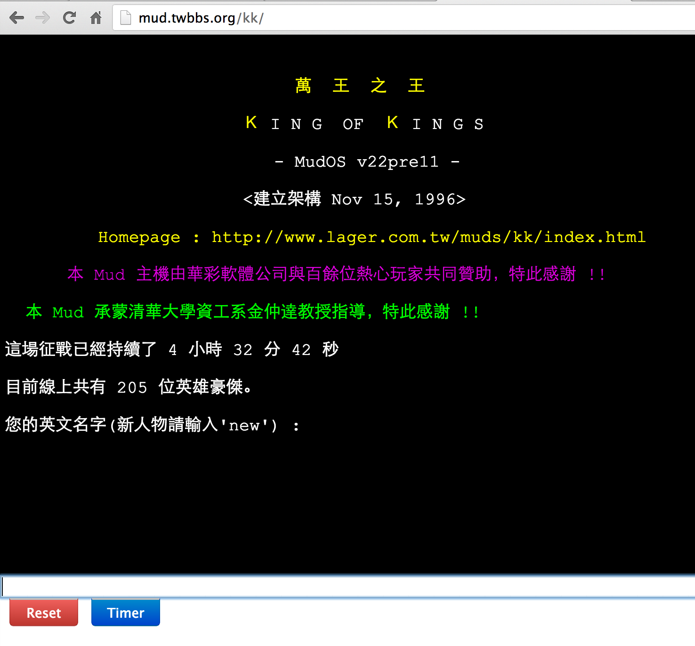
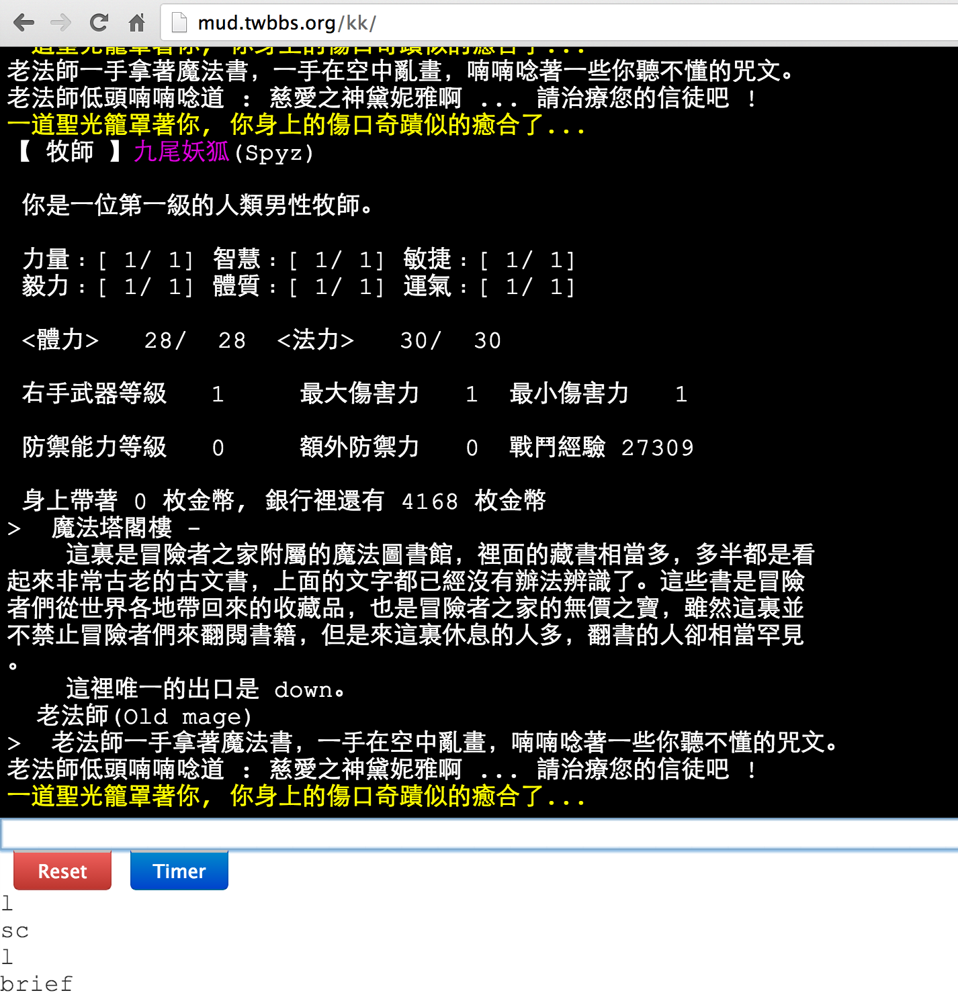

WebMud
----------------------
Play MUD in Browser with Your Own Proxy.

## Sample Site (King of Kings): http://mud.twbbs.org/kk



## Sample Site (Doom): http://mud.twbbs.org/doom

## Install on your server:
  1. Download Source Code Zip and Unzip
  2. Go to folder: booter/bin
  3. sudo sh runkk.sh
  4. Go to http://[your ip address]/kk

## Customize for other MUDs:
  * open src/mud.properties in webmud.war
  * add new config for new MUD, ex:

```js
  doom.url=140.126.11.213
  doom.port=4000
  doom.encoding=MS950
```

  * modfiy runkk.sh with replace "kk" by "doom"
  
## Timer
  Will send msg to MUD server per 10 mins to avoid timeout.

nk0ew0se3
